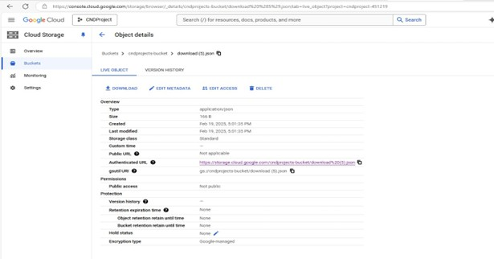

# 📁 PROJECT - PHOTO STORAGE APPLICATION

## Introduction

This course project involves developing, deploying, and enhancing a web application using Google Cloud Run. The web application of the deployed Cloud Run service enables users to upload images, which are then stored in a Google Cloud Storage bucket. Upon each upload, the Gemini API is invoked to generate a JSON file containing a title and description for the uploaded image. This JSON file, named to match the uploaded image, is stored in the same bucket.

The application provides a user-friendly interface where images are displayed as clickable links, each linking to the respective image along with its generated metadata (title and description).

Building upon this foundation, the project further explores automated deployment and revision management within the Cloud Run environment. The existing Cloud Run service is integrated with GitHub, enabling continuous deployment. Every time changes are pushed to the GitHub repository, a new revision is automatically deployed in the Revisions section of the existing Cloud Run service. Traffic is set to 100% for the latest deployed revision, ensuring that all users are served the most up-to-date version of the application.

This automation streamlines development and ensures efficient, hands-free updates to the live application.


---

## 🎯 Goals and Objectives

- ✅ Deploy a scalable and user-friendly web application using Google Cloud Run.
- ✅ Enable users to upload images through the web application.
- ✅ Store uploaded images securely in Google Cloud Storage.
- ✅ Integrate the Gemini API to generate metadata (title and description) for each image and store it as a JSON file.
- ✅ Display uploaded images as clickable links for easy access and viewing.
- ✅ Ensure that clicking on an image shows both the image and its associated metadata.
- ✅ Implement a deployment process using Cloud Run's revision and traffic management.
- ✅ Set traffic to 100% for the latest revision to ensure users always access the newest version.
- ✅ Automate deployment so that any GitHub push triggers an auto-deploy to Cloud Run.

---
## Implemented Features

- **Image upload functionality:** Users can select and upload images through a file upload interface.

- **Cloud Storage integration:** Uploaded images are securely stored in a Google Cloud Storage bucket.

- **Gemini API integration:** For each uploaded image, the Gemini API generates a title and description, which are stored as a JSON file in the same bucket with the same name as the image.

- **Image display and interaction:** Uploaded images are shown as clickable links. Clicking on a link opens the image along with its generated metadata (title and description).

- **Scalable deployment:** The application is deployed on Google Cloud Run, allowing it to scale automatically based on traffic, ensuring high availability and performance.

- **Automated deployment:** Any changes made to the GitHub repository are automatically deployed to the Cloud Run service. When a commit is pushed, a new revision is created and deployed without the need for manual steps, ensuring the application stays updated.

- **Traffic management:** The traffic is set to 100% for the latest deployed revision, ensuring that all users access the most up-to-date version of the application.

- **Revision management:** Google Cloud Run creates a new revision each time a change is committed to the integrated GitHub repository. The service automatically updates to the latest revision, maintaining the most current version of the application in production.

---
### Architecture


---

## 🔄 Application Workflow (Component-Wise Explanation)

### 🧑‍💻 Users → Cloud Run: Upload Images
Users interact with the web application to upload images through a simple interface.  
**Importance:** This is the starting point of the workflow. Without user-uploaded images, no processing can begin.

---

### ☁️ Cloud Run → Google Cloud Storage (Bucket): Store Images and Metadata
Cloud Run stores uploaded images in Google Cloud Storage. Metadata (title and description from Gemini API) is stored as a JSON file alongside the image.  
**Importance:** Centralized and scalable storage solution for both files and metadata.

---

### 🤖 Cloud Run → Gemini API: Request Metadata Generation
Cloud Run sends the image to Gemini API to generate AI-based title and description.  
**Importance:** Adds contextual information to each image, improving user experience and searchability.

---

### 🔁 Gemini API → Cloud Run: Return Metadata
Gemini returns the generated metadata (title + description) back to Cloud Run.  
**Importance:** This metadata is stored in GCS to complete the upload cycle with content and context.

---

### 🔐 Cloud Run → IAM: Grant Permissions to GCS and Gemini API
IAM policies allow Cloud Run to interact with both GCS and Gemini API.  
**Importance:** Security and authorization. Without these, the application cannot function.

---

### 🛠️ GitHub → Cloud Run: Auto-Deploy on Push
Code pushed to GitHub auto-triggers a deployment to Cloud Run.  
**Importance:** Ensures the app is always live with the latest changes and enables CI/CD.

---

### 📦 Cloud Run → New Revision: Deploy Updates
Every deployment creates a new revision in Cloud Run.  
**Importance:** Enables versioning, rollbacks, and stability during updates.

---

### 🚦 Latest Revision → Traffic Management
Cloud Run routes 100% of user traffic to the latest deployed revision.  
**Importance:** Ensures users always access the most updated version of the application.

---

## ⚙️ Implementation Breakdown

### 1. Users (Interacting with the App)
**Frontend:** HTML form to upload images via `/` endpoint.  
**Uploads:** Supports JPEG and PNG files.  
- **POST request** uploads the image.
- **GET request** lets users view the image + metadata.
- Endpoint `/files/<filename>` serves metadata from JSON.

**How it works:**  
- User uploads → backend sends to GCS → Gemini generates metadata → app fetches metadata + displays it.

---

### 2. Cloud Run (Deployment Platform)
**Framework:** Flask App  
**Port:** 8080 (default for Cloud Run)  
**Deployment:** Cloud Run handles auto-scaling, traffic routing, HTTPS access.  
**No firewall config needed.**  
**How it helps:** No manual infrastructure setup, reliable public endpoint, autoscaling.

---

### 3. Google Cloud Storage (Bucket)
**Purpose:** Stores both image files and JSON metadata.  
**Bucket Setup:**  
- Uses environment variable `BUCKET_NAME`  
- Private access by default  
**Storage Logic:**  
- Uploaded image → stored as `.jpg` or `.png`  
- Metadata → stored as `.json` (same name)

**How it helps:** Links every image to a context-rich JSON file. Fast, durable, and scalable.

---

### 4. Gemini API (Image Metadata Generation)
**Function:** Sends uploaded images to Gemini API to generate a title and description.Gemini API returns a title and description for each uploaded image 
**API Key:** Stored in environment variable `GEMINI_API_KEY`.  
**Example:**  
```python
genai.configure(api_key=os.environ["GEMINI_API_KEY"])
```
---
**Storage:** Parses and saves this metadata as a JSON file in Google Cloud Storage linked to the image.  
**How it helps:** Automatically generates meaningful metadata for every uploaded image.

---
### 5. GitHub Repository  
**Files:** Contains three files needed to deploy the current web application to Cloud Run.  
**Deployment:** Connected to Cloud Run for continuous deployment; pushing updates to `main.py` triggers automatic deployment.  
**How it helps:** Ensures seamless, automated deployment without manual steps.

---

### 6. Latest Deployed Revision  
---

---
**Details:** Each deployment gets a unique revision ID that appears above previous revisions.  
**Purpose:** Each revision is a snapshot of the app at deployment time, preserving previous versions for reference or rollback.  
**How it helps:** Enables version control and easy rollback.

---

### 7. Traffic Management  
---

---

---
**Current Setup:** 100% of user traffic is routed to the latest deployed revision with a white background.  
**Older Revisions:** Displayed with green or blue backgrounds, inactive but available for rollback.  
**How it helps:** Controls which app version users interact with, ensuring they see the latest features and UI consistently.

---
### Project Structure
---
deployment/
---
│
---
├── main.py # Main application logic (Flask app routes and functionality)
---
├── Procfile # Specifies how the application should be run on Cloud Run
---
└── requirements.txt # Python dependencies required for the app
---

---

# Pros

- Cloud Run dynamically adjusts to traffic, ensuring the app scales based on the number of requests, especially useful for fluctuating workloads.
- Cloud Run instances are stateless, allowing multiple instances to handle requests concurrently without affecting functionality.
- Google Cloud Storage (GCS) stores images, making them globally accessible to any instance, preventing data loss during scaling.
- Deployment is straightforward using `gcloud run deploy` and can be done directly from the source directory.
- Images and metadata stored in Cloud Storage allow users to access uploaded content seamlessly from any instance.
- The app integrates well with Google services like Cloud Storage and Gemini AI for efficient operations.
- Changes pushed to GitHub trigger automatic deployment to Cloud Run, reducing manual steps and enabling continuous delivery.
- All traffic is routed to the most recent revision, ensuring users experience the latest features and updates.
- Older revisions remain inactive but are retained for rollback if needed, maintaining operational safety.
- The application scales automatically based on incoming traffic, ensuring consistent performance regardless of demand.
- Manual traffic controls allow quick reassignment of traffic to previous revisions if rollback is necessary.

---

# Cons

- Due to Cloud Run’s stateless nature, user sessions and context might be lost when requests route between different instances.
- Cold starts can cause delays when new instances spin up after idle periods.
- Distributed handling of requests may cause issues with user session continuity.
- High upload frequency or heavy traffic can lead to throttling or delays accessing Cloud Storage, especially for large files.
- Uploading and processing large images may increase response times and latency.
- The solution lacks built-in user authentication; custom security must be implemented.
- Instances are ephemeral, so any data stored locally is lost on scale down, complicating state management.
- Relying on the latest deployed revision means any bugs affect all users immediately.
- If the latest revision fails, users experience downtime until traffic is manually redirected, possibly degrading user experience.

---

# Problems Encountered and Solutions

- **Issue:** Gunicorn error "worker spawn failed" and Pillow library not recognized.  
  **Solution:** Used `pip freeze` to verify dependency versions and updated `requirements.txt` accordingly, fixing Pillow version.  

- **Issue:** `main.py` bound to fixed port (5000) incompatible with Cloud Run dynamic ports.  
  **Solution:** Modified `main.py` to bind dynamically to the environment’s assigned port by using:  
  ```python
  app.run(host="0.0.0.0", port=int(os.environ.get("PORT", 8080)))
  ```
  ---
## Instructions to Start/Deploy the Application

1.Set the working directory to the project folder
```python
cd path/to/directory
```

2.Navigate to the application folder (in this project, it’s named deployment)
```python
cd deployment
```

3.Before testing locally, create and download the Google service account key JSON file.

Set the path to this key in the shell:

For macOS/Linux:
```python
export GOOGLE_APPLICATION_CREDENTIALS=path/to/downloaded-keyfile.json
```
For Windows (cmd):
```python
set GOOGLE_APPLICATION_CREDENTIALS=path\to\downloaded-keyfile.json
```

4.Automatically generate the requirements.txt file with installed dependencies
```python
pip freeze > requirements.txt
```

5.Verify dependencies and versions included in requirements.txt
```python
pip freeze
```

6.Create a Procfile with the following content to deploy the Flask app on Cloud Run using Gunicorn:
```python
web: gunicorn --bind :$PORT --workers 1 --threads 8 --timeout 0 main:app
```

7.Export necessary environment variables before running the app locally (replace with your actual keys)
```python
export GEMINI_API_KEY=your_gemini_api_key

export PROJECT_ID=your_project_id

export BUCKET_NAME=your_bucket_name
```

8.Test the app locally on your machine
```python
python main.py
```

9.Authenticate with Google Cloud and set your project
```python
gcloud auth login

gcloud config set project YOUR_PROJECT_ID
```

10.Deploy the application to Cloud Run, including environment variables (adjust service-name and region)
```python
gcloud run deploy service-name \
  --source . \
  --region your-region \
  --platform managed \
  --allow-unauthenticated \
  --set-env-vars GEMINI_API_KEY=your_gemini_api_key,PROJECT_ID=your_project_id,BUCKET_NAME=your_bucket_name
```
---

## Using the Application

1. Once the Cloud Run service link is active, authorized users can access the deployed app. Users click the "Choose File" button to select an image from their local machine and then use the "Upload" button to upload the image.
---

---
2. After a successful upload, the image status is confirmed by seeing it appear as a clickable link below the upload button. (For example, the screenshot shows 8 images with names like download.jpg, download.jpeg.)
---

---

3. Clicking the link of any uploaded image displays the image content along with its generated title and description below it.
---

---
4. The uploaded image file, along with the corresponding JSON metadata file sharing the same name, can be verified in the specified Google Cloud Storage bucket.
---

---
5. Clicking the URL link of the JSON file in the bucket or downloading it will show content (title and description) that exactly matches what is displayed for the image.
---


---
---

## Lessons Learned

- Integrating Google Gemini AI for dynamic image description generation provided practical experience with AI-powered services, but also presented challenges with inconsistent AI responses.
- To improve robustness, error-handling and retry logic were implemented.
- Debugging and error handling during deployment to Cloud Run proved essential, highlighting the importance of reviewing logs to resolve issues.
- Integrating the GitHub repository with Cloud Run enabled seamless automatic deployment where every commit to `main.py` creates a new revision of the service.

---

## Areas to Improve

- Moving Gemini API metadata generation to background tasks or queue systems like Cloud Pub/Sub could reduce delays or timeouts during high traffic.
- Implementing efficient storage management and automatic rules for older files would improve scalability.
- Adding user authentication (e.g., OAuth2) is important to secure the system and prevent unauthorized access.
- Improving the frontend UI with upload progress bars or image previews would enhance user experience.
- Introducing backend monitoring tools and error reporting would help detect and fix issues proactively.
- Storing metadata in BigQuery would facilitate easier searching and analysis for future scalability.

---

## Scalability and Success Potential

- The application can handle millions of users due to Google Cloud Run’s automatic scaling based on traffic.
- Cloud Storage offers reliable, scalable storage for images and metadata, suitable for large data volumes.
- The automated deployment pipeline ensures efficient updates with minimal downtime.
- For sustained success at scale, enhancements such as authentication, rate limiting, improved error handling, and monitoring will be crucial.
- With these improvements, the application can remain stable, secure, and responsive as the user base grows.

 

